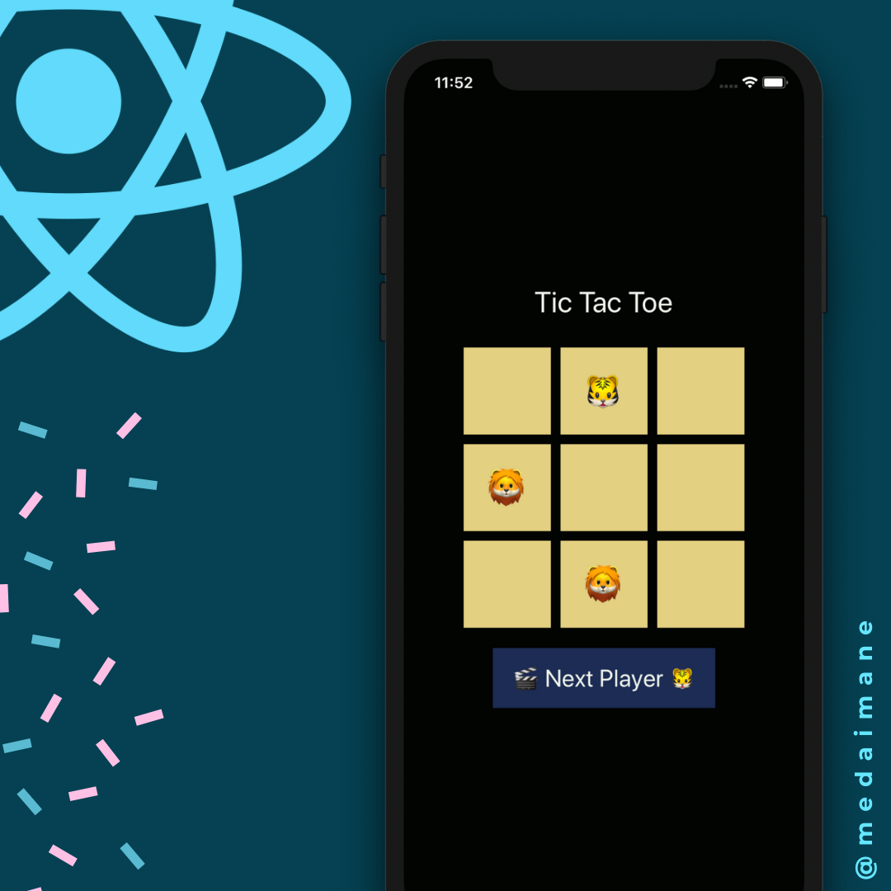
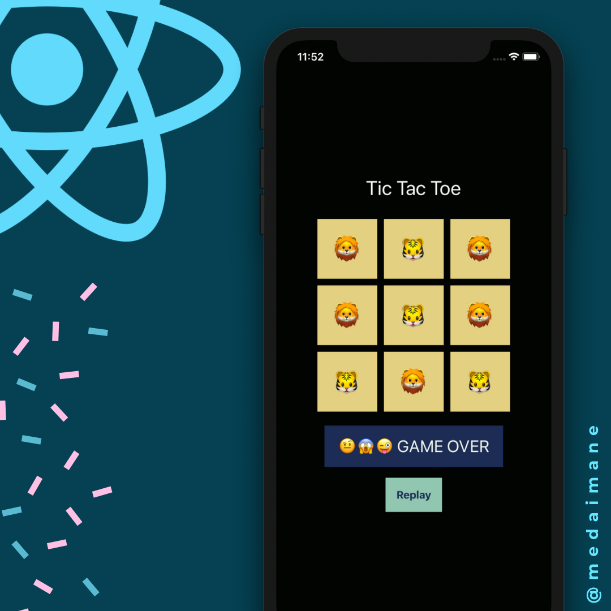
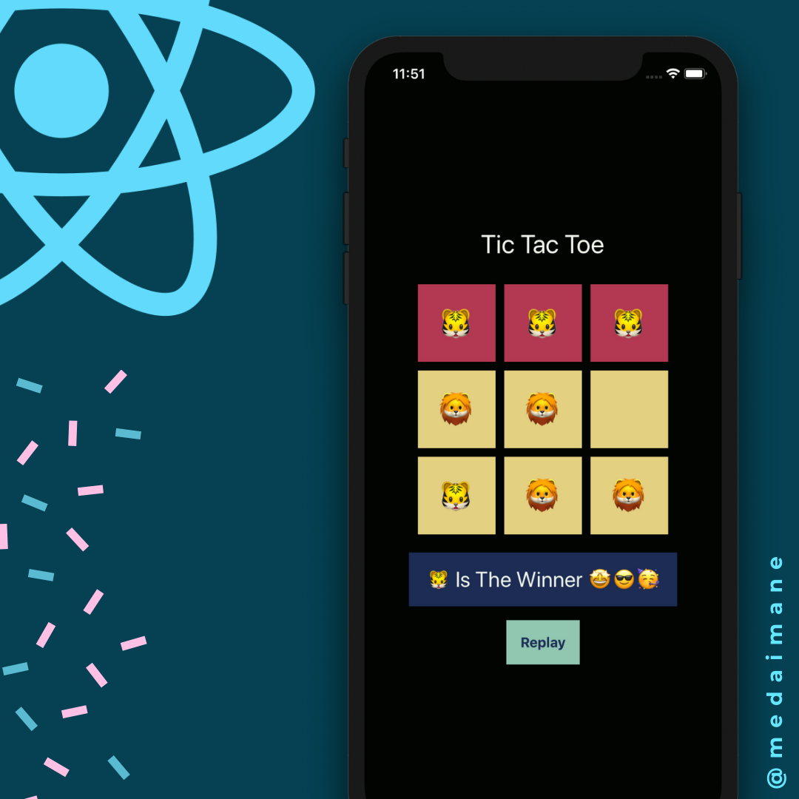

<h1 align="center">
  React Native 2020 by<br><a href="http://medaimane.github.io/">medaimane</a>
</h1>

<p align="center">
  <strong>Tic Tac Toe Game</strong><br>
  Build a simple tic tac toe game using React Native.
</p>

## Specifications

- Draw the board of `3 x 3` squares.
- Tow players for the game :
  - First player goes with `X`.
  - Second player goes with `O`
- Game continue :
  - Until one of the players draw a win line of the same symbols.
  - Or until all the squares are filled.
- If game finished:
  - Show winining or draw state.
  - Show replay button.
- Reinit the game if replay button pressed.

## Screenshots

- Initial, playinng, draw and win states:

<div align="center" >
  
  
  
  
</div>

## Instructions

- Requirement:

  - Install `node.js`, `yarn` and `react-native-cli`.
  - Install Android or iOS development environment. Checkout the docs for more information on how to
  [get started with React Native](https://reactnative.dev/docs/getting-started).

- Clone repo code:

```bash
git clone repo-url
```

- Install dependencies:

```bash
yarn
```

- Start dev server:

```bash
yarn start
```

- Run App:

```bash
yarn ios || yarn android
```

## Creators

  Mohamed Aimane Skhairi
  skhairimedaimane@gmail.com

## License

This project is created under the MIT license :)
